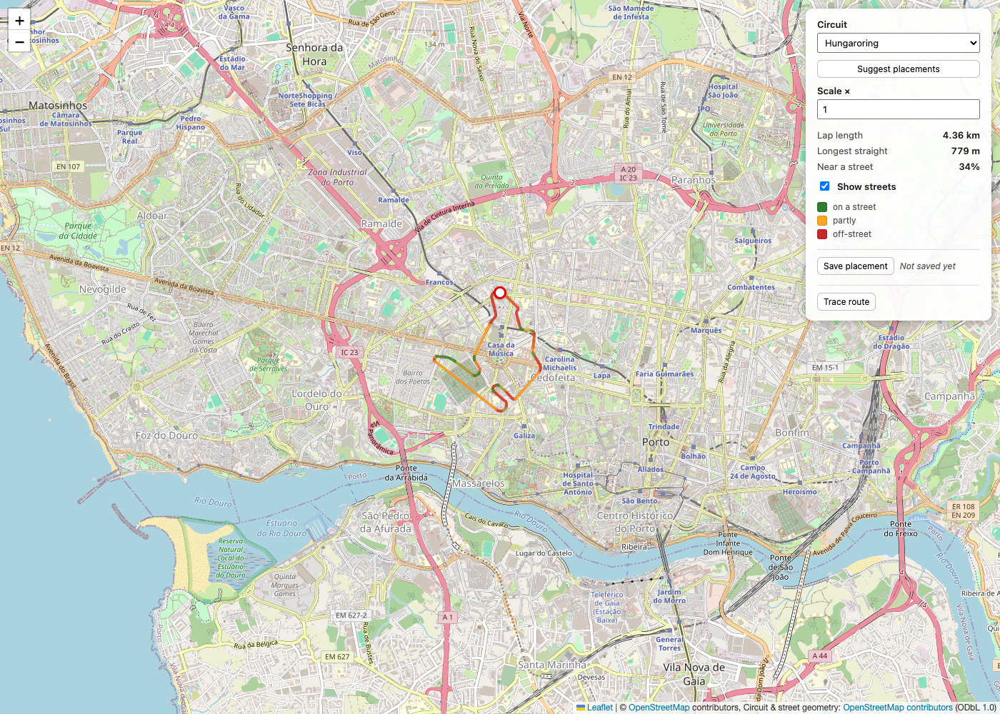
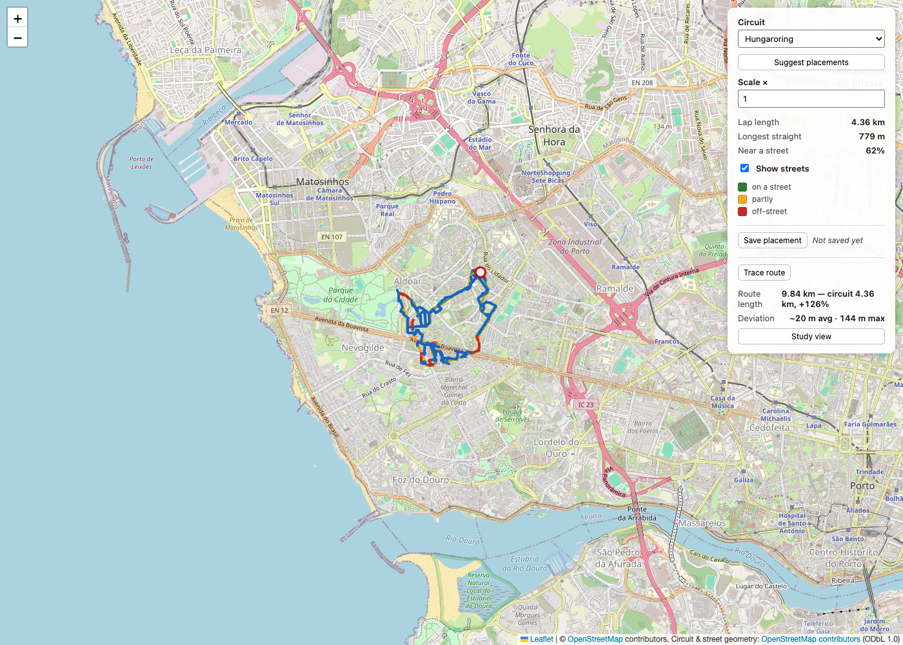
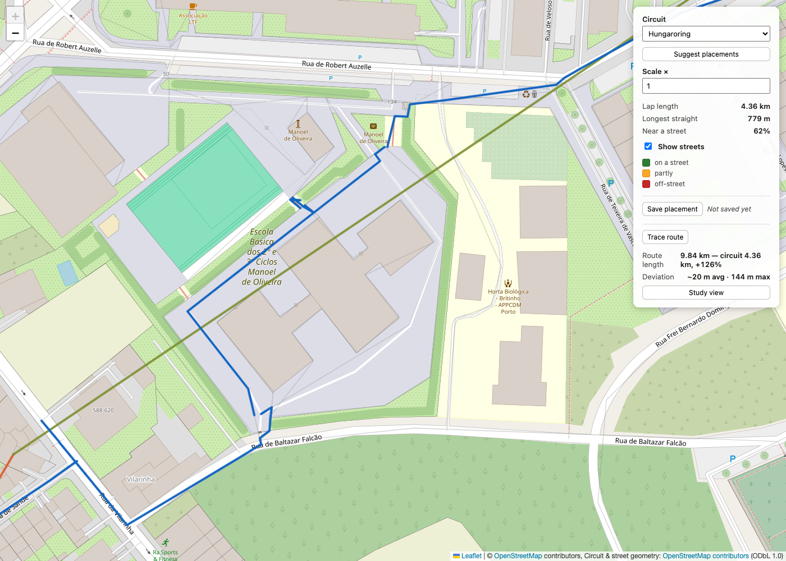

# Independent code review: automatic circuit matching (2026-09-13)

Scope of this review, by request: the **code as it stands today**, judged only
against the product goal in [VISION.md](../VISION.md) — a runner should be
able to look at the drawn route and recognise the circuit's shape, at real
scale. This review does not weigh in on how the code got here, phase-by-phase
decisions, or effort already spent; those are covered in
[ROADMAP.md](../ROADMAP.md)'s decision log and are treated here only as prior
telemetry to cross-check against the live system.

## Method

- Read the full pipeline the "Suggest placements" feature depends on:
  `geo.ts`, `geometry/{transform,straight,turning,procrustes,path,vector}.ts`,
  `streets.ts`, `graph.ts`, `app/proximity.ts`, `app/trace.ts`,
  `match/{objective,search,straights,loopSearch,types}.ts`, `ui/controls.ts`,
  `app/map.ts`.
- Re-ran `src/match/loopSearch.test.ts`'s real-Porto-data test in isolation to
  get fresh, first-hand numbers rather than trusting the roadmap's own report
  of them.
- Ran the full test suite once (`npx vitest run`) to check current health.
- Built and drove the actual app in a headless browser (Playwright against a
  local Chrome, since Playwright's bundled Chromium does not support this
  machine's macOS version) against the real `npm run dev` server: picked
  Hungaroring, clicked **Suggest placements**, applied the top-ranked
  suggestion, and inspected the rendered map at several zoom levels.
  Screenshots are in `docs/reviews/2026-09-13-assets/` and referenced below.

## Executive summary

**The automatic matching pipeline (`Suggest placements` → routed / best-effort
loop, roughly Phases 6–12) does not deliver the product's central promise, and
this is confirmed independently, not just repeated from the roadmap.** For all
three bundled circuits, on every run:

- **0 of 15 total suggestions (5 per circuit × 3 circuits) form a real closed
  loop.** Every single suggestion falls back to a "best-effort" loop with
  invented straight-line gaps.
- Those best-effort loops are **1.43× to 2.24× the circuit's real length**
  (i.e. a 4.4 km circuit comes back as an 8.3–9.7 km "route") — a direct
  violation of VISION.md's "a 2 km straight is a ~2 km straight" principle.
- **17–48% of the 60 sampled points per loop are unresolved**, drawn as
  straight fabricated segments cutting across blocks, parks, and in one
  inspected case, directly through a school's internal grounds.
- Visually, the result does not read as the source circuit at all: it is a
  tangled scribble confined to one small residential pocket, not the circuit's
  characteristic outline. See screenshots below.

This is not a bug in the ordinary sense — the code does exactly what it was
designed to do, is well-tested, and is honest about its own limitations in the
UI copy ("street gaps", "off shape", "retraces a street" are all shown
plainly, never hidden). **The defect is architectural**: the search finds a
*rigid* placement of the circuit's undeformed outline and then tries to
validate or patch a real street loop underneath it. Real, organic city street
grids have no reason to contain an undistorted copy of a purpose-built racing
circuit's outline, so this can only succeed by luck — and across three very
different circuit shapes and six phases of honest tuning, it never has.

By contrast, the parts of the codebase that do **not** try to auto-generate a
full loop — the raw overlay (Phase 2), the street-proximity heatmap (Phase 3),
and manual street-following tracing (Phase 5/7) — are correct, well-tested,
and *do* preserve the circuit's real shape and scale. The gap between "what
the app can show you" and "what it can find for you automatically" is the
whole story of this review.

## Evidence

### The raw overlay is faithful — the base geometry is not the problem

This is the circuit dropped at its default placement, before any search runs.
The shape is immediately recognisable as Hungaroring's rounded top and
characteristic lower esses, at the correct real-world scale. `geo.ts`'s
projection, `geometry/transform.ts`'s similarity transform, and the Phase 2/3
overlay + proximity rendering are all doing their job correctly. Whatever goes
wrong happens later, in the search and loop-construction stages.

### The top-ranked automatic suggestion

This is the **best of five** ranked suggestions for the same circuit,
produced by clicking **Suggest placements** and **Use this** on the top row.
The panel reports it honestly: *"9.66 km loop · 10 street gaps (749 m) · ~20 m
off shape"* against a 4.36 km circuit — **+126% length**. The drawn shape does
not resemble Hungaroring's oval-with-esses outline; it is a dense knot of
switchbacks confined to a ~600 m × 400 m pocket of the Aldoar/Boavista
neighbourhood, doubling back on itself repeatedly.

### A gap leg resolves through a school's grounds

Zooming into one stretch of that same suggestion shows the route snaking
through the internal paths of a school complex (Escola Básica Manoel de
Oliveira), including a sharp, needless V-shaped there-and-back right at a
property corner. Whether this particular stretch resolved as a "real" edge or
a straight gap, the point stands either way: nothing in `graph.ts` or
`match/loopSearch.ts` distinguishes a public street from an internal path
inside a fenced institutional compound, so "runnable" here means "a path
exists in the bundled OSM extract," not "a member of the public can actually
run this."

### Numbers, verified first-hand (not copied from the roadmap)

Re-running `src/match/loopSearch.test.ts`'s `searchRoutedLoops — real Porto
data` test in isolation (`npx vitest run src/match/loopSearch.test.ts -t
"real Porto data" --reporter=verbose`) on 2026-09-13:

| Circuit | Real length | Routed | Best-effort ratios (best→worst) | Gap legs (of 60) | Gap length |
| --- | --- | --- | --- | --- | --- |
| hungaroring | 4356 m | 0/5 | 1.91×, 1.93×, 2.10×, 2.22×, 2.24× | 10–22 | 749–1603 m |
| silverstone | 5869 m | 0/5 | 1.43×, 1.48×, 1.50×, 1.57×, 1.87× | 12–28 | 1139–2720 m |
| catalunya | 4667 m | 0/5 | 1.84×, 1.89×, 1.95×, 1.97×, 2.04× | 19–29 | 1488–2131 m |

Every number matches what the live app actually rendered for the case
screenshotted above (9.66 km / 10 gaps / 749 m — the hungaroring row's best
entry), so this is a genuine, reproducible characteristic of the current code
against the bundled Porto data, not a stale figure or a cherry-picked run.

### Test suite health

`npx vitest run` (full suite, no isolation from the real-data tests): **282
passed, 4 failed** — all four failures are in `src/app/map.test.ts`, timing
out at the default 5 s Vitest timeout under the load of building the full
graph repeatedly. Reproduced independently of the roadmap's own note about
this. Not the focus of this review, but flagged in §Secondary findings below
since CONVENTIONS.md requires the default suite to pass.

## Root cause

`match/search.ts`'s `searchPlacements` sweeps **translation and rotation
only, at a fixed scale, of the circuit's untouched outline**
([search.ts:58-196](../../src/match/search.ts)), scoring each rigid pose by
how much of that outline sits near correctly-aligned real streets
(`match/objective.ts`'s `scoreCandidate`). It never bends, stretches, or
otherwise adapts the shape to the street network — by construction, it is
looking for a spot in Porto that already happens to contain an undistorted
copy of the circuit.

`match/loopSearch.ts`'s `tryRouteLoop` then asks a much harder question of
that same rigid outline: does a real, fully-connected closed walk exist along
its exact path? ([loopSearch.ts:52-111](../../src/match/loopSearch.ts)). For
an organic, hilly, dense city grid versus a purpose-built racing circuit's
geometry, the answer is essentially never — confirmed structurally (0/15
across every bundled circuit, every run) rather than by one unlucky case.

`buildBestEffortLoop` ([loopSearch.ts:122-175](../../src/match/loopSearch.ts))
is the fallback: it resamples that **same undeformed, never-adapted outline**
and snaps each of 60 points to the nearest correctly-aligned street
independently, drawing a straight line wherever nothing qualifies. Because the
shape was never adapted to what streets actually exist, this doesn't converge
towards something route-shaped — it inflates length and litters the result
with invented segments, exactly as measured above.

**The project's own six-phase tuning history (Phases 7–12) is itself strong
evidence this is a diminishing-returns dead end for the chosen strategy, not
a "nearly there" situation.** Connectivity repair, direction-aware snapping,
real-street anchoring, and diversity-of-candidates were all real, careful,
correctly-implemented improvements — and they moved the best-case length
ratio from the original ~2.15–3.6× down to 1.43–2.24×, while the routed-loop
count stayed at exactly 0 throughout every single phase. Tuning knobs
(`CORRIDOR_M`, `MAX_LENGTH_RATIO`, alignment tolerance, candidate pool size)
were each investigated and shown not to be the blocker (see the Phase 9 and
Phase 8 decision-log entries) — the blocker is the rigid-pose model itself.

## What already works and should not be touched

- `geo.ts`, `geometry/*`: correct closed-form similarity/turning/Procrustes
  math, with property-based tests. No issues found.
- `graph.ts`: genuinely solid infrastructure — tolerance-based endpoint
  merging, T-junction splitting, and segment-crossing repair (with a
  hand-verified grade-separation exclusion list) took real connectivity from
  88.3% to ~95.3% of network length. The A* implementation is correct.
- `streets.ts` / `app/proximity.ts`: correct spatial indexing and
  direction-aware coverage scoring; this is what drives the (accurate, useful)
  green/amber/red heatmap on the live overlay.
- `app/trace.ts` + Phase 5/7 manual tracing: joins waypoints via real
  shortest paths and honestly flags any leg it can't connect. **This is the
  one workflow in the app that both uses real streets and keeps the shape
  under direct user control** — exactly VISION.md's "judgement stays with the
  user" principle, and exactly the "acetate on a map, slide it by hand" model
  the vision document describes. It works today.

## Secondary findings (lower priority)

1. **Test flakiness under load.** Four `app/map.test.ts` tests fail on a
   5-second Vitest timeout when the suite runs at full parallelism (confirmed
   in this review's own run, not just the roadmap's note). CONVENTIONS.md
   requires the default suite to pass; a documented "known to be flaky" note
   in the roadmap isn't the same as a green CI. Cheap fix: raise the timeout
   for the graph-building tests or share a built graph fixture across them.
2. **No accessibility/plausibility filter on street selection.** Every check
   in `graph.ts` / `match/loopSearch.ts` is purely geometric (distance,
   heading, connectivity). Nothing distinguishes a public street from a path
   inside a fenced school or private compound, so a "real" leg can route
   somewhere a runner cannot actually go. Seen directly in the screenshot
   above.
3. **Misleading honesty.** The UI labels (`ui/controls.ts`'s
   `formatSuggestionLabel`) are commendably transparent about gaps and
   deviation — but the practical effect, given finding above, is that
   *every* automatic suggestion for *every* bundled circuit is currently a
   9–11 km tangle for a 4.3–5.9 km circuit. A feature that is honest about
   being wrong 100% of the time is still a feature that doesn't work; the
   honesty doesn't offset the core defect, it just avoids compounding it with
   a false claim.

## Is this fixable? Two honest paths, not one verdict

The direct answer to "is this impossible to improve with the resources
available" is: **impossible for the specific approach taken (rigid-pose
search + patch the gaps) to reach a satisfying visual result — the
project's own six phases of careful tuning already demonstrate that
ceiling.** But the product goal itself is not impossible: the parts of the
app that don't try to force a full automatic loop already meet VISION.md's
bar today. The choice is about which problem to keep solving automatically.

### Phase A — Stop presenting a broken result as a feature (low cost, low risk)

Currently "Suggest placements" always returns something styled as a loop to
run, even though it is, 100% of the time, 1.4–2.2× too long with a third or
more of its length invented. Recommendation: change what the feature *claims*
to do, not (yet) the underlying search.

- Keep Phase 6's geometry-only ranking (translation + rotation + coverage +
  turning + Procrustes) — it is correct and useful for finding *where in
  Porto* the circuit's shape best fits the street layout.
- Drop the promise of a "loop" from the default suggestion list: present the
  ranked spots as **candidate starting placements** ("62% on streets, ~14 m
  avg deviation" — Phase 6's own honest, already-working numbers), not as a
  best-effort route with a length and a gap count.
- Retire (or hide behind an explicit "try to force a full loop, results will
  likely be long and gappy" opt-in) `tryRouteLoop` / `buildBestEffortLoop`'s
  role in the default suggestion flow. Nothing needs deleting — the code is
  fine and well-tested — but it should not be the default, headline result
  for a feature currently marketed as finding you a route to run.
- **Cost:** a few days — UI copy, `ui/controls.ts` label logic, and
  `app/map.ts` wiring changes; no new algorithm. **Risk:** essentially none —
  this narrows a claim to match what the code actually delivers.

### Phase B — Corner-anchored, human-adjustable placement (moderate cost, low-moderate risk)

An earlier draft of this phase proposed simply pointing the user at a
candidate placement and letting them trace it by hand over the proximity
heatmap. **That is not enough, and it is worth being explicit about why:** a
blank map plus a heatmap still leaves the hard part — finding a sequence of
real streets that actually closes into a loop — entirely on the human, who is
bad at exactly that kind of graph-connectivity search. That is the same
problem Phases 8–12 tried and failed to solve automatically; pushing it onto
the user instead of the algorithm doesn't make it tractable, it just moves
where the failure is felt.

The revised design keeps the automatic *search* for connectivity — which the
graph and A* in `graph.ts` already do correctly — but drops the rigid
whole-shape pose that Phase 6–12 depend on, replacing it with a small number
of independently-adjustable landmarks:

- **Reduce the outline to its significant corners**, not 60 uniform samples.
  `geometry/turning.ts`'s `cumulativeTurning` already computes the exact
  signal needed (local curvature along the circuit); picking its peaks gives
  perhaps 10–15 real corners per circuit instead of a dense, rigid stencil.
- For each corner, **search independently** for the nearest well-aligned real
  street corner, allowed to drift a bounded amount from where the rigid pose
  would have put it — each landmark gets its own local slack instead of the
  whole shape living or dying on one global translation/rotation.
- **Route between consecutive landmarks with the existing, correct A***
  (`StreetGraph.shortestPath`), and show the resulting length/deviation
  landmark-by-landmark, honestly, the same way `formatSuggestionLabel`
  already does for the current (broken) loops.
- Critically, **make each landmark draggable**: when the automatic pick for
  one corner produces an ugly detour, the user's job is to nudge that one
  point to a better real corner nearby — informed, local corrections, not
  tracing several kilometres of streets from nothing, and not trusting a
  single rigid transform to get all 10-15 corners right at once.
- This reuses every already-correct primitive (`graph.ts`'s connectivity and
  A*, `geometry/turning.ts`'s curvature, `app/proximity.ts`'s heatmap) and
  keeps "judgement stays with the user" (VISION.md) honest: the computer
  proposes and searches, the human corrects the few points that need it,
  instead of either being asked to solve everything (old manual tracing) or
  being handed a result that silently failed everywhere (Phases 8–12).
- **Cost:** larger than a cosmetic change but well short of a new algorithm —
  corner extraction is a small addition to existing turning-function code,
  per-landmark search reuses `nearestAlignedPointM` almost as-is, and the
  drag-to-adjust interaction is new UI work on top of the existing map/overlay
  plumbing. Realistically a full spec-sized phase, possibly two.
  **Risk:** low-moderate — the individual pieces are all proven; the new risk
  is entirely in the interaction design (how corner count, drift radius, and
  drag affordance feel in practice), which is cheap to iterate on once built,
  not a research question like Phase C's.

### Phase C — A genuinely different automatic algorithm (high cost, high risk — optional)

If full automation is still wanted after A and B ship, the only path with a
real chance of a *visually* satisfying result is the one already named and
deliberately deferred in ROADMAP.md's "Later" list: **a shape-first search
that bends the loop street-by-street** (e.g., constrained shortest-cycle
search that tracks the circuit's own turning-function profile as it grows,
rather than validating a rigid pose after the fact).

- This is a materially different algorithm from everything in
  `match/`/`graph.ts` today, not a tuning pass on it — expect a genuine
  research-and-prototype phase, not a spec-and-implement phase.
- **Real risk of failure with nothing to show for it:** there is no guarantee
  Porto's actual street geometry (dense small blocks, hills, non-orthogonal
  medieval core) can produce a loop that both closes and reads as, say,
  Spa-Francorchamps's sweeping high-speed corners — the constraint may simply
  not be satisfiable to a standard a runner would call "recognisable," no
  matter the algorithm.
- **Recommendation if pursued:** timebox it as an explicit spike with a kill
  criterion decided in advance — e.g., "a prototype against the three bundled
  circuits must get at least one circuit under 1.15× length with under 10%
  gap, or the effort is shelved in favour of Phase A/B only." Do not let this
  turn into another six-phase tuning cycle on a second architecture without a
  pre-agreed stopping point, since that is exactly what happened to Phases
  7–12.

## Recommendation

Ship Phase A immediately — it is a truth-in-advertising fix, not a redesign,
and stops the app from handing users a result that undermines trust in the
whole tool. Follow with Phase B, which is where this project's real
comparative advantage already is (correct geometry, correct routing, honest
measurement — VISION.md's "judgement stays with the user" done properly).
Treat Phase C as optional and separately justified later, not as the next
default phase — six phases already went into the current approach without
reaching a routed loop for any bundled circuit, and there is no code-level
evidence a seventh phase on the *same* model would end differently.

Phases A and B are now written up as implementation-ready specs, following
this project's own "spec before implementation" working method:
[docs/specs/phase-13-honest-suggestions.md](../specs/phase-13-honest-suggestions.md)
and
[docs/specs/phase-14-corner-anchored-placement.md](../specs/phase-14-corner-anchored-placement.md).
Phase 14's design is the corner-anchored, human-adjustable one discussed
after this review's first draft (independent per-corner search + drag-to-fix,
not a blank map with a heatmap) — see that spec for the reasoning behind the
change.
